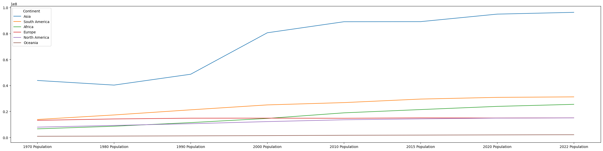
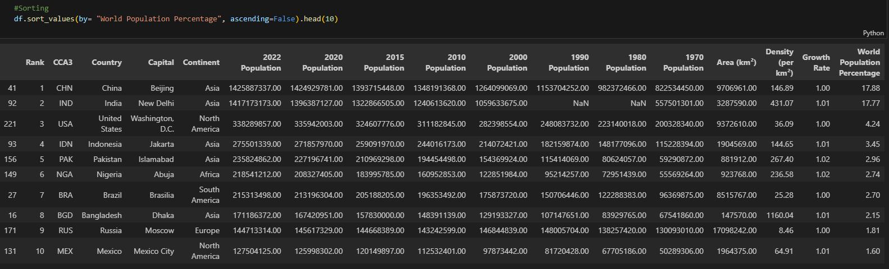

# 🌍 World Population EDA and Insights

---

## 📝 Summary  
This project explores global population trends using Python’s data analysis tools. It focuses on cleaning, analyzing, and visualizing demographic data from the world_population dataset to uncover insights about population growth, density, and continental trends.  

---

## 🔧 What I Did  

- **Data Loading & Exploration**  
  - Imported **pandas**, **seaborn**, and **matplotlib** for analysis and visualization.  
  - Loaded and inspected the dataset, which includes metrics like population (1970–2022), area, density, growth rates, and continent classifications.  

- **Data Cleaning**  
  - Checked for missing values and unique entries.  
  - Formatted numerical columns for readability.  

- **Descriptive Statistics**  
  - Generated summary statistics (mean, min, max, quartiles) for population and density metrics.  
  - Identified top countries by **"World Population Percentage."**  

- **Visualizations**  
  - Analyzed trends using sorted data and correlation matrices (notebook output).  
  - Plotted growth rates, population distributions, and continental comparisons.  

- **Key Insights**  
  - Explored relationships between area, density, and population growth.  
  - Highlighted countries with the highest growth rates and population percentages.  

---

## 📚 What I Learned  

- **Handling Missing Data**: Identified and addressed gaps in historical population metrics.  
- **Data Transformation**: Used **pd.set_option** to improve numerical readability.  
- **Statistical Analysis**: Calculated descriptive stats and identified outliers (e.g., countries with NaN values in 2015).  
- **Visual Storytelling**: Leveraged **seaborn** and **matplotlib** to create intuitive charts for trends.  
- **Global Trends**: Observed population shifts across continents and decades, such as Africa’s high growth rates.  

---

## ✅ Result  
The analysis reveals:  

- **Top Contributors**: China, India, and the U.S. account for over 40% of the world’s population.  
- **Continental Trends**: Africa and Asia show the highest growth rates.  
- **Density Insights**: Microstates (e.g., Monaco) have extreme population density despite small areas.  
- **Final Output**: A cleaned dataset, statistical summaries, and visualizations for data-driven decision-making.  

---

## 🌄 Screenshots (Placeholder Examples)  
- **Population Growth Trends (1970–2022)**  
    
- **Top 10 Countries by World Population Percentage**  
    

---

## 🌱 Future Improvements  

- **Time Series Forecasting**: Predict population trends for 2030–2050.  
- **Interactive Dashboard**: Build a **Tableau**/**Power BI** dashboard for dynamic exploration.  
- **Economic Correlation**: Compare population metrics with GDP or urbanization data.  
- **Geospatial Mapping**: Plot density and growth on a global map using **geopandas**.  

---
